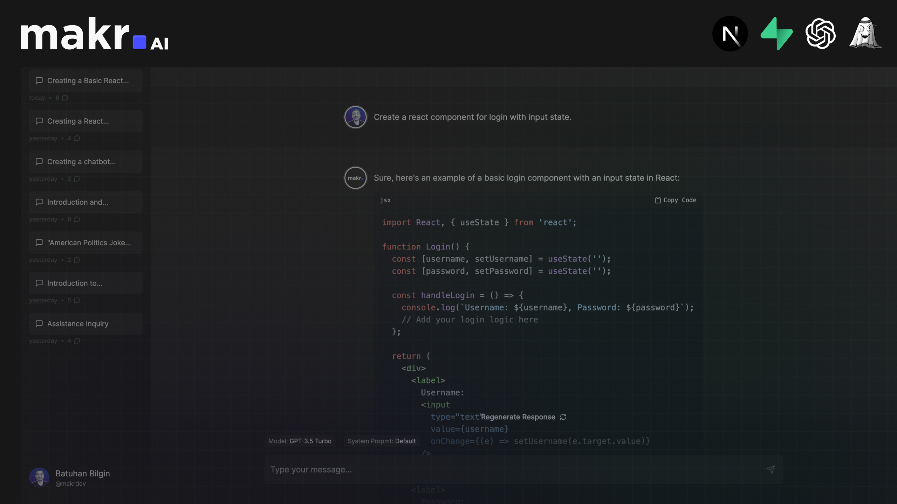

# makr.AI

makr.AI is a ChatGPT clone with enhanced features for makers & indie hackers built on top of using Next.js, TypeScript, Supabase, Jotai and Tailwind CSS.



Check this [Youtube video](https://youtu.be/yrXLvCB0ByA) to learn more.

## Roadmap

I'll be building new features over time. If you have any suggestions, feel free to open a discussion or reach out to me on [Twitter](https://twitter.com/makrdev). I listed the features I'm working on next below.

**What to expect:**

- [ ] Long-term Memory for Conversations (Supabase's Vector Database)
- [ ] Propmt Library
- [ ] Organising Conversations with Folders etc.
- [ ] Collections Library for saving responses
- [ ] Plugins ecosystem with GPT agents

## Deploy

**Vercel**

Host your own live version of Chatbot UI with Vercel.

[](https://vercel.com/new/clone?repository-url=https://github.com/batuhanbilginn/makr-ai)

**Replit**

Fork Chatbot UI on Replit [here](https://replit.com/@MckayWrigley/chatbot-ui-pro?v=1).

## Running Locally

**1. Clone Repo**

```bash
git clone https://github.com/mckaywrigley/chatbot-ui.git
```

**2. Install Dependencies**

```bash
npm i
```

**3. Provide OpenAI API Key**

Create a .env.local file in the root of the repo with your OpenAI API Key:

```bash
OPENAI_API_KEY=YOUR_KEY
```

> You can set `OPENAI_API_HOST` where access to the official OpenAI host is restricted or unavailable, allowing users to configure an alternative host for their specific needs.

> Additionally, if you have multiple OpenAI Organizations, you can set `OPENAI_ORGANIZATION` to specify one.

**4. Run App**

```bash
npm run dev
```

**5. Use It**

You should be able to start chatting.

## Configuration

When deploying the application, the following environment variables can be set:

| Environment Variable  | Default value                  | Description                                                                 |
| --------------------- | ------------------------------ | --------------------------------------------------------------------------- |
| OPENAI_API_KEY        |                                | The default API key used for authentication with OpenAI                     |
| OPENAI_API_HOST       | `https://api.openai.com`       | The base url, for Azure use `https://<endpoint>.openai.azure.com`           |
| OPENAI_API_TYPE       | `openai`                       | The API type, options are `openai` or `azure`                               |
| OPENAI_API_VERSION    | `2023-03-15-preview`           | Only applicable for Azure OpenAI                                            |
| OPENAI_ORGANIZATION   |                                | Your OpenAI organization ID                                                 |
| DEFAULT_MODEL         | `gpt-3.5-turbo`                | The default model to use on new conversations, for Azure use `gpt-35-turbo` |
| DEFAULT_SYSTEM_PROMPT | [see here](utils/app/const.ts) | The default system prompt to use on new conversations                       |
| GOOGLE_API_KEY        |                                | See [Custom Search JSON API documentation][gcse]                            |
| GOOGLE_CSE_ID         |                                | See [Custom Search JSON API documentation][gcse]                            |

If you do not provide an OpenAI API key with `OPENAI_API_KEY`, users will have to provide their own key.
If you don't have an OpenAI API key, you can get one [here](https://platform.openai.com/account/api-keys).

## Contact

If you have any questions, feel free to reach out to me on [Twitter](https://twitter.com/mckaywrigley).

[gcse]: https://developers.google.com/custom-search/v1/overview
